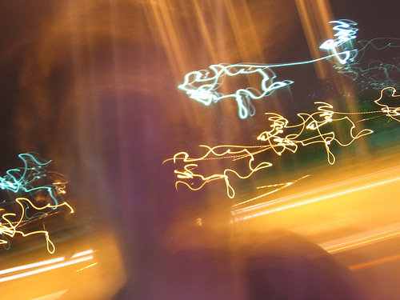

# jSimpleFader Demo Page #

By [Miles Rausch](http://milesrausch.com)

jSimpleFader is a jQuery plugin to simply fade between images.

```html
<script src="http://ajax.googleapis.com/ajax/libs/jquery/1.8.2/jquery.min.js"></script>
<script src="jquery.simplefader.js"></script>
```

To use your fader, you simply call it on the element containing the image you want to rotate. That image doesn't have to be the only HTML in the element &ndash; the script will use the first image it finds. The only thing you need to provide is the total number of images you want to rotate through. The script assumes you've numbered your images like: "image1.jpg", "image2.jpg", "image3.jpg", &amp;c.

```html
<div id="fader1">
    <span></span>
</div>
<script>
    $('#fader1').simplefader( 4 );
</script>
```

The image you provide doesn't have to be the first image in your series, but you do need to have images starting at 1. It will start fading from the image you provide, working in order.
    
You can optionally pass in an options object. Here are the options you can set:

  * speed &ndash; the speed of rotation (default: 5000 ms)
  * animationSpeed &ndash; the speed of fading (default: 600)

```html
<div id="fader2">
    
</div>
<script>
    $('#fader2').simplefader( 4, { speed: 2500, animationSpeed: 300 } );
</script>
```

Browse the `demo.html` file to see it in action.
